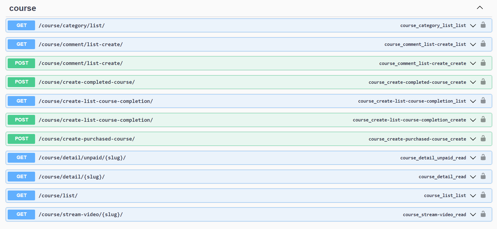
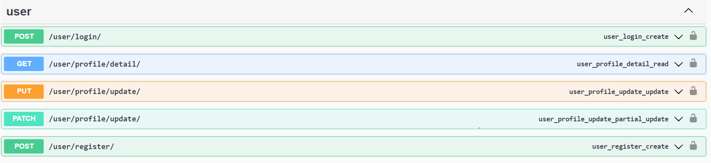
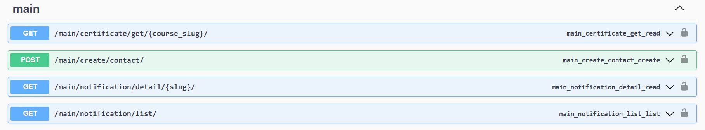
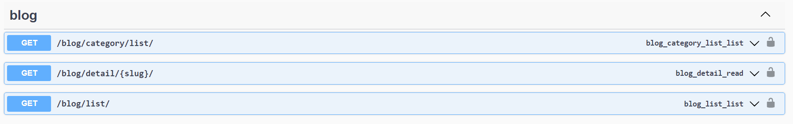

# Backend API for "Ayol uchun" website!

"Ayol uchun" is a socio-cultural, educational, public platform. This project aims to 
provide multidisciplinary intellectual support to women who are ready to develop and 
change their lifestyle for the better. On this platform, women will be able to study 
in the courses they need, participate in webinars, and read interesting articles.

### Tech & Tools
 
 

### Functional

- User registration and login 
- Editing a user profile
- Purchase courses
- A certificate will be generated for users who complete the course
- Filter the list of courses
- Ability to comment on courses
- Read articles
- Receive notifications

### Database schema
 

### API images
#### Course app
 

#### User app
 

#### Main app
 

#### Blog app
 